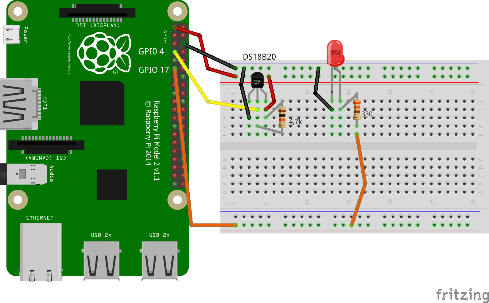

# MQTT - publish sensor data
The application reads data from the sensor every five seconds and publishes it with mqtt.  

## used languages, libraries and technologies
* C programming
* MQTT - mosquitto
* json-c, gpio, wiringpi

## prerequisites
* Raspberry Pi
* MQ Broker ( RabittMQ, Mosquitto Broker etc ...  )
* network environment ( connection between server and client )

## installation instruction

### set up Raspberry Pi
*  **install necessary C libraries**
    *  mosquitto
      ```
      sudo apt-get install libmosquitto-dev
      ```
    * json-c
    ```
    sudo apt-get install libjson-c-dev
    ```
    * gpio
    ```
    sudo apt-get install gpio
    ```
    * wiringpi
    ```
    sudo apt-get install wiringpi
    ```
    * cmake
    ```
    sudo apt-get install cmake
    ```

* **enable one wire interface**
    * insert `dtoverlay=w1–gpio` to the bottom of file `/boot/config.txt`
    * reboot the Pi: `sudo reboot`
    * adding module `w1-gpio` and module `w1-therm` to `/etc/modules` for starting them automatically.
    _optional_ - manually start: 
    ```
    sudo modprobe w1–gpio
    sudo modprobe w1-therm 
    ```

### install mqtt sensor
*  **get source code**
    * clone github repository
    ```
    git clone https://github.com/fhscaly/dmm-sensor.git
    ```

* **install C programm** 
    * create MAKE file
    ```
    cmake CMakeLists.txt
    ```
    * compile code
    ```
    make 
    ```
    * executable `mqtt_sensor` has been created
    
### wiring of DS18B20 sensor
* **electronic components**
    * DS18B20 one wire temperature sensor
    * LED
    * resistor ( 4,7kΩ for Sensor, 330Ω for LED)
    
* **GPIO outputs**
    * GPIO 4 for DS18B20 sensor
    * GPIO 17 for LED
    
* **overview of wiring**


## usage
* execute mqtt_sensor
```
./mqt_sensor <IP of message broker>
```

## MQTT

* **connection parameter**
    * QoS = 1
    * RetainMessages = false

* **published topic**
    * SENSOR/LOCAL/TEMPERATURE
    
* **message format**
    * JSON
    ```json
         payload = {
            "timestamp": 1560895411,
            "warehouseId": "FH00017",
            "assetId": "-1",
            "assetName": "HOME:TS001",
            "eventType": "PUBLISH",
            "refreshInterval": 5,
            "values": [{
            "key": "data",
            "type": "FLOAT",
            "value": "25.250000"
            }]
         }
    ```
* **data types of message**
    * header
    ```
    /*
     *  timestamp       -> timestamp of the event as UNIX Epoch milliseconds.
     *  warehouseId     -> Worldwide unique project number -> must be configurable!
     *  assetId         -> identification of the source (sensor, motor, component, etc.)
     *  assetName       -> Unique identification of the source (sensor, motor, component, etc.)
     *  eventType       -> Identifier of the message type.
     *  refreshInterval -> Time in seconds, when the next event is to be expected -> quasi a kind of watchdog Functionality. Set to -1 to deactivate.
     *  values          -> Array of [Key, Type, Value] triples with the current (measured) values. Maximum 24!
    
     */
    typedef struct {
        time_t time;
        char *warehouse_id;
        int asset_id;
        char *asset_name;
        char *event_type;
        int refresh_interval;
        int value_count;
        Message_value* values;
    } Message_header;
    ```

    * value
    ```c
    /*
     *  key   -> name of the value field
     *  type  -> Type of the value field (SHORT, INTEGER, LONG, FLOAT, DOUBLE, BOOLEAN, TIMESTAMP, STRING, JSON)
     *  value -> Current (measurement) value as JSON string
     */
    typedef struct {
        char *key;
        char *type;
        char *value;
    } Message_value;
    ```
    

    
    


